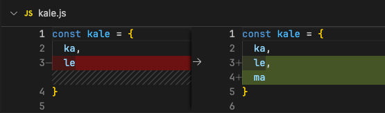
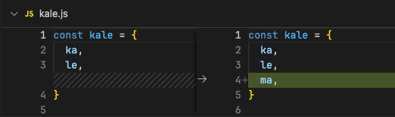

# 代码风格

统一团队的编码规范，目的是统一一些相对主观化的代码风格，有助于代码的维护与协同开发。

## 引号

使用**单引号**

JS中，单双引号并无区别，据说性能更好，并且输入时不需要额外按`Shift`键

```js
let kale = "卡了" // 👎

let kale = '卡了' // 👍
```

## 分号

**不使用**分号

JS 中不需要在每个语句的末尾有分号，JS 引擎可以确定一个分号应该在什么位置然后自动添加它。对于是否应该使用分号，也有许多争论，本规范推荐不使用分号，因为好的工程师应该知道什么时候该加，什么时候不该加。

```js
let kale = '卡了'; // 👎

let kale = '卡了' // 👍

// 如IIEF前必须加分号，避免代码在压缩合并时可能发生错误
;(() => {
  console.log(kale)
})()
```

## 缩进

使用**两个空格**作为缩进

代码保持一致的缩进，是作为工程师的职业素养。关于缩进格式的争论太多了，也得不出答案。本规范结合了市面上优秀的 JS类 开源项目，约定使用 两个空格 来缩进。

```js
// 👎
function kale() {
    console.log(kale)
}

// 👍
function kale() {
  console.log(kale)
}
```

## 变量命名

变量使用**小驼峰（constiableName）**，常量使用**全大写下划线（CONSTIABLE_NAME）**

变量名需要能明确表达出变量在程序中的作用，不要用**含糊不清**的缩写
## 数组和对象的的拖尾逗号

拖尾逗号的好处是，简化了对象和数组添加或删除元素，我们只需要修改新增的行即可，并不会增加差异化的代码行数。在最后一个元素或属性与闭括号`]` 或 `}` 在不同行时，使用拖尾逗号。当在同一行时，禁止使用拖尾逗号。

```js
// 👎
const kale = { ka, le, }
const kale = {
  ka,
  le
}

// 👍
const kale = { ka, le }
const kale = {
  ka,
  le,
}
```

在`code diff`时更加美观

👎


👍


## 空格和换行

合理的空格和换行可以使代码更有易读性和层次感，使得维护者更容易理解代码逻辑与运行流程

```js
// 👎
const onIsPassConfirm = (isPass) => {
  if(loading) return
  setOpenPass(false)
  api.AndonClose({ AndonGuid: curAndonRecord.AndonGuid, IsPass: isPass }).then(() => getAndon()).finally(() => setLoading(false))
}

// 👍
const onIsPassConfirm = (isPass) => {
  if(loading) return

  setOpenPass(false)

  api.AndonClose({
    AndonGuid: curAndonRecord.AndonGuid,
    IsPass: isPass,
  }).then(() => {
    getAndon()
  }).finally(() => {
    setLoading(false)
  })
}
```

```js
// 👎
const ka = 1,le = 2
const kale = ka+le
const kale = {ka,le}
const kale = <Kale/>

// 👍
const ka = 1, le = 2
const kale = ka + le
const kale = { ka, le }
const kale = <Kale />
```

## 嵌套层级

程序中避免不了有复杂判断条件造成的if或三元运算符等的嵌套地狱，应避免出现多重嵌套，大大破环代码可维护性，以下是一些避免嵌套编程的参考

> [为何要成为“不嵌套主义者”](https://www.bilibili.com/video/BV1ov4y167WE)

> [表驱动编程](https://zhuanlan.zhihu.com/p/259806449)

### 尽早retuen

```js
// 👎
const onCodeSubmit = (code) => {
  if(code) {
    api.CodeValidate({
      Code: code,
    }).then(({ data }) => {
      const first = list[0]
      
      if(first === undefined) {
        list.push(data)
      } else {
        if(list.find((l) => l.SublotGuid === data.SublotGuid)) {
          showToast('已添加')
        } else {
          if(`${data.ProductGuid}` === `${first.ProductGuid}`) {
            list.push(data)
          } else {
            showToast('该批次无法一起发货')
          }
        }
      }
    })
  }
}

// 👍
async function onCodeSubmit(code) {
  if(code === '') return

  const { data } = await api.CodeValidate({
    Code: code,
  })

  const first = list[0]

  if(first === undefined) {
    list.push(data)
    return
  }
  
  if(list.find((l) => l.SublotGuid === data.SublotGuid)) {
    showToast('已添加')
    return
  }

  if(`${data.ProductGuid}` !== `${first.ProductGuid}`) {
    showToast('该批次无法一起发货')
    return
  }

  list.push(data)
}
```

### 表驱动编程

```jsx
// 👎
const getTag = (task) => {
  return task.State === '生产中' ? <GreenTag /> : task.State === '未开始' ? <GrayTag /> : <RedTag />
}

// 👍
const getTag = (task) => {
  const tags = {
    '生产中': <GreenTag />,
    '未开始': <GrayTag />,
    '故障': <RedTag />,
  }
  return tags[task.State]
}
```

## 导入和导出

### import

同一个包的导入，只使用一个`import`，超过一定数量时推荐换行

```js
// 👎
import { useState } from 'react'
import { useEffect } from 'react'
import { useMemo } from 'react'
import { useCallBack } from 'react'
import { memo } from 'react'

// 👍
import { useState, useEffect, useMemo, useCallBack, memo } from 'react'

// 👏
import {
  useState,
  useEffect,
  useMemo,
  useCallBack,
  memo,
} from 'react'
```

### export

为了使热更新能按预期正常工作，编写组件或页面的文件应该只导出这个页面或组件

> [参考](https://www.gatsbyjs.com/docs/reference/local-development/fast-refresh/#how-it-works)

### 标签

一个组件没有`children`时，应该使用自闭合标签

自闭和标签的闭合符号前应有且仅有一个空格

属性之间空一格

```jsx
// 👎
<Input value={value}  withKeyBoard></Input>

// 👍
<Input value={value}  withKeyBoard/>

// 👏
<Input value={value} withKeyBoard />
```

## 注释

注释应另起一行空一格，位于被描述代码块上方，用来描述代码解释复杂逻辑，而不是用来注释无效代码

```js
// 👎
function kale() { //判断网络状态
  // ...
}

// 👍
//判断网络状态
function kale() {
  /**
   * @todo
  */
}
```

## Prettier和ESLine

不推荐使用，这对编写良好的代码是一种伤害

## 新语法

鼓励使用新语法

我们的`pc端`只需要兼容到兼容win7的最后一个chrome版本`109`

`android端`兼容到Android7的自带webview版本`51`
