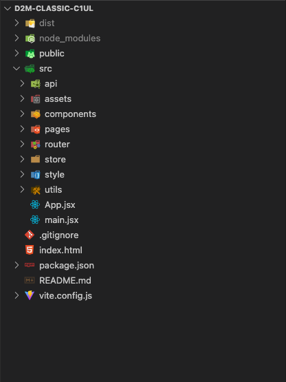

# 项目结构

统一团队的编码规范，目的是统一一些相对主观化的代码风格，有助于代码的维护与协同开发。

## 初始化

使用脚手架或者项目模版初始化项目（建设中。。。）

## 目录结构

按照通用功能进行分类的原则，不按业务功能进行拆分，再根据实际情况灵活调整（如进一步拆分小模块），参考已有项目



### 组件文件名

文件名以及导出的组件应以组件类型结尾，组件名使用大驼峰规范，如

::: code-group

```jsx [configDialog.jsx]
export const ConfigDialog = () => {}
```

```jsx [keyboardInput.jsx]
export const KeyboardInput = () => {}
```

:::

## 定期更新依赖

选择第三方库时，尽量选择轻量的现代库，老古董不要，并且定期更新项目依赖
